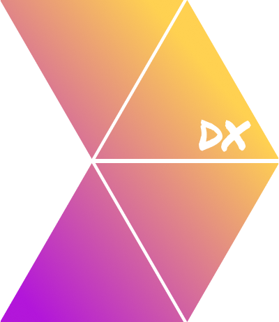

# DX-analytics-webpack-plugin

</img>

[](https://github.com/fforres/webpack-plugin-dx-metrics/actions?query=workflow%3Atest) [](https://www.npmjs.com/package/@fforres/webpack-plugin-dx)

This webpack plugin is written in typescript, and serves as a way to quickly gather meaningful information on a webpack project's usage and sending it to datadog via [datadog-metrics](https://github.com/dbader/node-datadog-metrics).

Plugin keeps track of execution of different [webpack hooks](https://webpack.js.org/api/compiler-hooks/), and using a series of timers, calculates and reports on things like compilation or recompilation time.

## So... What can I do with it?

Adding it to your webpack's config in `dev` mode, it will track every project compilation and module recompilation time, so you can track how your project's developer experience is performing in your teammate's machines.

For example, this is a screenshot a datadog dashboard created with this plugin.


## Install

If your are using yarn

```bash
yarn add --dev @fforres/webpack-plugin-dx
```

or if you use npm

```bash
npm install --save-dev @fforres/webpack-plugin-dx
```

## Usage

you can see some usage of it in [./webpack.config.dev.js](./webpack.config.dev.js) But in essence you require the `@fforres/webpack-plugin-dx` and use in in the plugins in your webpack config. At a bare minimum you need to pass you datadog api key, you can get it from **https://<YOUR_ORG>.datadoghq.com/account/settings#api**

```TYPESCRIPT
const UXWebpackPlugin = require('@fforres/webpack-plugin-dx');
module.exports = {
  {...}
  plugins: [
    new UXWebpackPlugin({
      datadogConfig: {
        /* DATADOG API KEY FROM https://<YOUR_ORG>.datadoghq.com/account/settings#api */,
        apiKey: 'random_key_string',
        /* The name of the current project, will be added to datadog as the `projectName` tag */
        projectName: 'some_cool_project_name'
      },
    }),
  ],
};
```

## Plugin Options

Options are defined by [`DXWebpackPluginProps`](./src/types.ts)

| Object Key         | Required | Default Value                                                   | Description                                                                                                                                                                                                                                                   |
| ------------------ | :------: | --------------------------------------------------------------- | ------------------------------------------------------------------------------------------------------------------------------------------------------------------------------------------------------------------------------------------------------------- |
| projectName        |   yes    |                                                                 | Datadog's project name, will be added to each track call as `projectName` tag                                                                                                                                                                                 |
| datadogConfig      |    no    | `{"prefix":"ux.webpack.","flushIntervalSeconds":2}`             | Config object for [Datadog Metrics](https://github.com/dbader/node-datadog-metrics#readme) - Typescript Type [here](https://github.com/DefinitelyTyped/DefinitelyTyped/blob/6970a8fffa0743f0f5fc918e187fa37f0d2675df/types/datadog-metrics/index.d.ts#L6-L36) |
| enabledKeysToTrack |    no    | `['recompile','recompile_session','compile','compile_session']` | An array of keys that will define what "keys" will be tracked. By Default we track all the keys                                                                                                                                                               |
| tags               |    no    | `{}`                                                            | Extra tags to be added to [Datadog Metrics](https://github.com/dbader/node-datadog-metrics#readme) - An object shape of `{ tagName: "tagValue", environment: "production" }`                                                                                  |
| dryRun             |    no    | `false`                                                         | If `true`, will not send tracking events to datadog.                                                                                                                                                                                                          |

```TYPESCRIPT
{
  projectName: string;
  datadogConfig?: BufferedMetricsLoggerOptions;
  enabledKeysToTrack?: TrackingMetricKeys[];
  tags?: { [key: string]: string };
  dryRun?: boolean;
}
```

## Development

- `git clone`
- `yarn`
- `yarn dev` to run a super-simple webpack-dev-server with the plugin `debug` enabled
- or `yarn debug` to run webpack with node `--inspect-brk` flag, and be able to debug using the [NIM - Node Inspector Manager](https://chrome.google.com/webstore/detail/nodejs-v8-inspector-manag/gnhhdgbaldcilmgcpfddgdbkhjohddkj?hl=en) chrome extension
- Once you have this running, go ahead and change (and save) a file inside [./app/](./app)

## Deploy

To deploy, create a PR and bump the the version in `package.json`. Once the PR
is merged it will deploy a new version of the package.

## Current things being tracked

| Metric               | Tracking key        | Description                                                                                                                                                                   | How are we tracking   |
| -------------------- | ------------------- | ----------------------------------------------------------------------------------------------------------------------------------------------------------------------------- | --------------------- |
| compilation          | `compile`           | Tracks only the time an application takes to compile the code. Regarding wepback hooks tracks from `"beforeCompile"` to `"compilation"`                                       | histogram             |
| compilationSession   | `compile_session`   | Tracks the time from when a webpack process starts, until it finishes. Regarding wepback hooks tracks from `"environment"` to `"done"`                                        | histogram & increment |
| recompilation        | `recompile`         | Tracks "only" the time an application takes to re-compile the code. (After the initial compilation). Regarding wepback hooks tracks from `"beforeCompile"` to `"compilation"` | histogram             |
| recompilationSession | `recompile_session` | Tracks the time when a webpack recompilation starts, until it finishes. Regarding wepback hooks, it tracks from `"watchRun"` to `"done"`                                      | histogram & increment |

## Things we might want to track but no decision yet

- **System info** [🔗](https://github.com/sebhildebrandt/systeminformation)
  > Creepy factor. 😬 However maybe useful on companies/internally. Being able
  > to debug, or on bigger companies it would be useful to figure out what type
  > of devices are slower/faster.
- **git commit sha.**
  > Creepy factor. 🤔
- **branch**
  > Creepy factor. 🤔

## Info I've gathered

Some info gathering on webpack compilation steps

| Webpack Hook name      | Runs in compilation | Runs in re-compilaton |
| ---------------------- | :-----------------: | :-------------------: |
| `environment`          |         ✅          |          ❌           |
| `afterEnvironment`     |         ✅          |          ❌           |
| `entryOption`          |         ✅          |          ❌           |
| `afterPlugins`         |         ✅          |          ❌           |
| `afterResolvers`       |         ✅          |          ❌           |
| `entryOption`          |         ✅          |          ❌           |
| `watchRun`             |         ✅          |          ✅           |
| `normalModuleFactory`  |         ✅          |          ✅           |
| `contextModuleFactory` |         ✅          |          ✅           |
| `beforeCompile`        |         ✅          |          ✅           |
| `compile`              |         ✅          |          ✅           |
| `thisCompilation`      |         ✅          |          ✅           |
| `compilation`          |         ✅          |          ✅           |
| `make`                 |         ✅          |          ✅           |
| `afterCompile`         |         ✅          |          ✅           |
| `shouldEmit`           |         ✅          |          ✅           |
| `emit`                 |         ✅          |          ✅           |
| `afterEmit`            |         ✅          |          ✅           |
| `done`                 |         ✅          |          ✅           |
